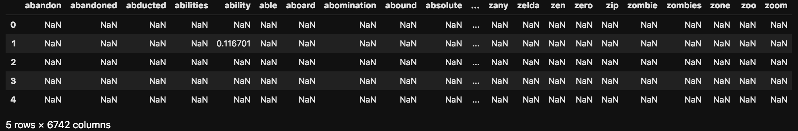
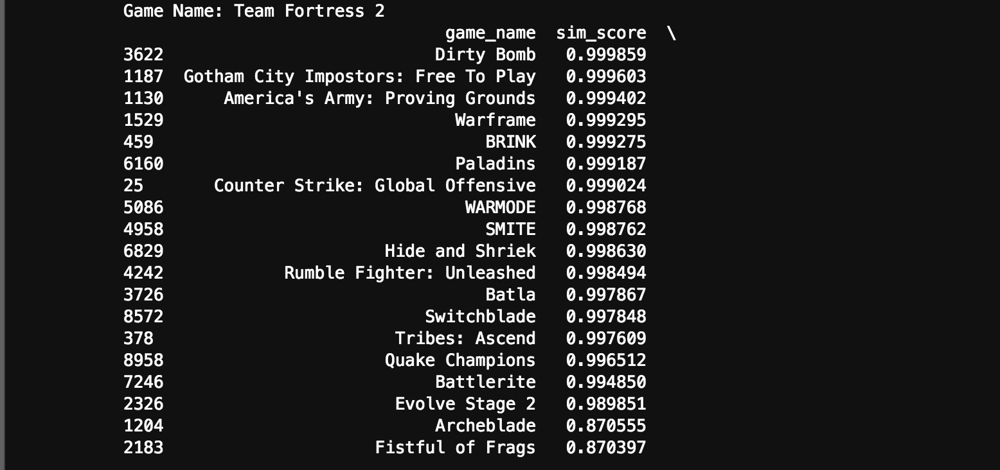
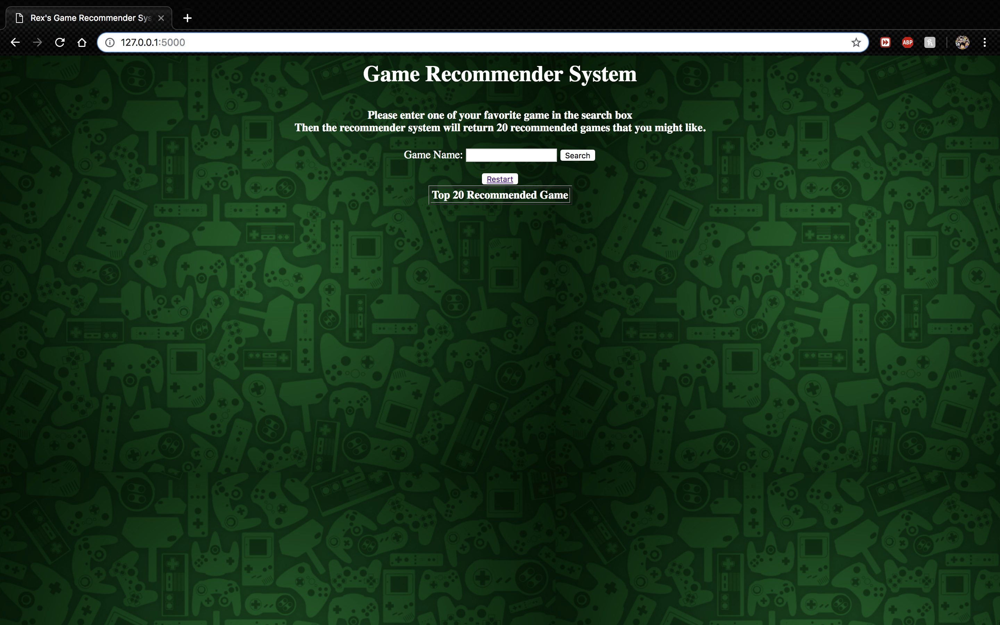
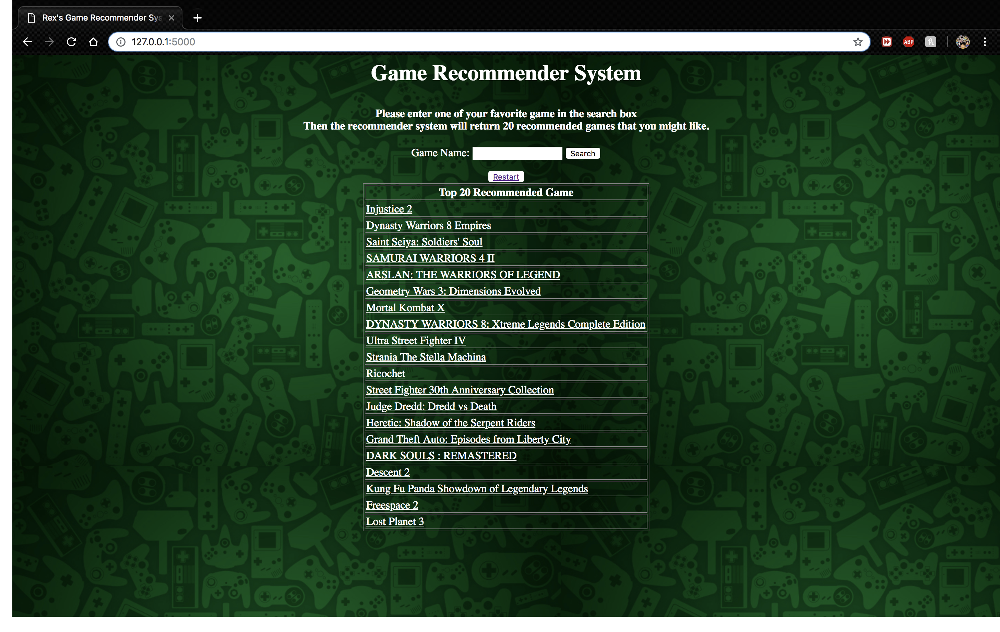

# Game Recommender System
---
## **Problem Statement:**

There are more games in the market nowadays compared with several decades ago. This often leads hardcore PC Gamers or users that are newly introduced to game, to struggle to chose a specific game they will like to invest time or money on. 

My objective is to design and create a search system for PC game recommendation that focuses on users like PC players and PC gamers. Users can simply input like what's their favorite game? or what game they played recently are interesting. The games in the recommender system will strictly based on the games offered on [Steam](https://store.steampowered.com/). Steam is a well-known gaming platform by Valve Corporation that contains a large game database and player base. 

This recommender system not only can be used for causal gamers on day-to-day bases, but also game company like [GameStop](https://www.gamestop.com/?&utm_medium=SDI&utm_campaign=BrandCore&utm_kxconfid=teby7kvd7&gclid=CjwKCAiA7vTiBRAqEiwA4NTO62ZagI6OscrsJzOp2hWxDz1aSfuYKtTUhqJ-rXZJjy0BVfHoYkvB3BoCVAgQAvD_BwE&gclsrc=aw.ds). Game stop offers varity of console games and you probably don't associate GameStop with digital PC games, but the company is hoping to change that. This model can offer the users from their website recommending games based on their interest and returns games they might like to boost thier digital PC games sales. 
The primary evaluation of my recommender system will be features based. There were many features Steam offered; however, Steam only provide so many features from through the web APIs. I plan to use the game description as part of the features. This will increase the number of unique features and hopefully increase the quality of our result.

## **Tools Used**

- flask
- html
- pandas 
- numpy 
- nltk
- sklearn
- scipy
- pylab 
- re
- matplotlib
- seaborn 

## **Data Scraping & Data Sets:**

I acquired my data through [Valve](https://developer.valvesoftware.com/wiki/Main_Page). Valve provides these APIs so website developers can use data from Steam in new and interesting ways. They allow developers to query Steam for information that they can present on their own sites. This site encourages us to gather data and like users review, users profiles. This allows me to quickly access to the information, games that I will be obtaining.

Vavle offers not only games but also soundtracks, DLCs etc.. so when acquiring API from Vavle, it will includes the entire app library they offered. I will perform 2 seperates API scrapping based on the App ID provided on each product. The first API is going  to be Game Genre and Categories. This will be considered as my game features. 

### **Data Features**

This is the game features that I will include to my modeling:

| Features | Description | 
| --- | --- |
| Action | the player assumes the role of a protagonist in an interactive story driven by exploration and puzzle-solving |
| Casual | They are typically distinguished by simple rules and by reduced demands on time and learned skill |
| Co-op | that allows players to work together as teammates, usually against one or more AI opponents |
| Free to Play | Free to play game |
| Gore | This usually falls under the game that is involed in blood, devil, or violent |
| Indie | Indie also kown as Independent Video Game, These games often focus on innovation and rely on digital distribution |
| MMO | Also known as Massive Multiplayer Online game, an online game with large numbers of players, typically from hundreds to thousands, on the same server |
| Multi-player | Although this is really similar to MMO, but some games isn't massive in terms of server |
| Nudity | scantily clad images or characters to sell or enhance games, some go further, using sex acts or nudity as a character motivation |
| RPG | Also known as Role Playing Game, where the player controls the actions of a character immersed in some well-defined world |
| Racing | player partakes in a racing competition with any type of land, water, air or space vehicles |
| Sexual Content | This is extreamly similar to the Nudity but this covers more than just nudity |
| Simulation | describes a diverse super-category of video games, generally designed to closely simulate real world activities. |
| Sports | that simulates the practice of sports, including team sports, track and field, extreme sports and combat sports |
| Strategy | that focuses on skillful thinking and planning to achieve victory |
| Violent | Game that contain violent content |
| VR Support | is an interactive computer-generated experience taking place within a simulated environment |

### **Game Description**

Since I am going to use the game description as part of my features from each game. I am going to clean up the text and perfrom a tozkenization followed by lemmatization to seperates the context into each individual words and use it as part of my features. After clearing the data, my game description will have 6,742 columns. All those columns will be put into part of the features for the games.

This is what the game description looks like:

### Final Model

After an in depth EDA and data cleaning, we're finally at our last step of creating a recommender system. I will first perform SVD to reduce the dimensionality of my final game data this will increase the computational more efficiency. Then I will calculate the cosine similarity of each games of another, this will return as an array of values from -1 to 1. Lastly,I will create a search function that will search the game and return the top 20 most similar games along with the direct link to the game website.

I will create a search function that doesn't require user to input the full name of the game and it will search the series or any game contain that input. For example: FINAL FANTASY have a lot of different series. If user input that only. I will give you all the final fantasy series along with the recommended games and website to visit.

I perform a quick demontration of the model's performance:

Team Fortress 2 is a first person cartoon style shooting game. Based on the result below, where I create a direct link to the specific game website at steam.

- Dirty Bomb: Dirty Bomb is a first person cartoon style shooting game. That offer in different classes/characters. It's a multi-player game.
- Gotham City Impostors: This is a Batman series based, cartoon style first person action game. This is a multi-player game.
- America's Army : This is a realistic, first person action shooter that is also multi-player game.

Based on above three games; we can clearly see the similar features that each game has. I personally played all those game before. This is a really good recommender. The reviews of the game is really good to that specific game as well.

### Further Steps and Future Planning

To further expand the usage of my model. I attempt to create a website that will correspond with my recommender model. I will need to create flask app with html. I did a little self-study on create website. The result came out to be good. With more time given, I can refine the website more along with the flask python that will bring out  detailed description of each game after recommendation was given. I also, will include the direct link to that specific game for user to easily access and purchase the game. Also, the website only works on my local host so far, this will restrict user from testing my recommender model at their machine. Heroku is a platform as a service (PaaS) that enables developers to build, run, and operate applications entirely in the cloud. This will be a good addition that can put my recommender system to production.

